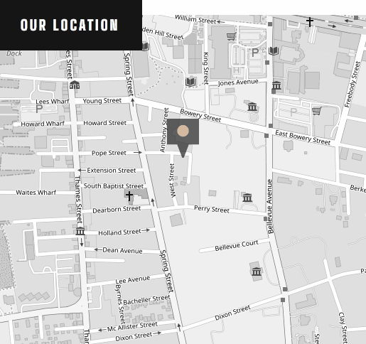

<h1 align="center">Art Gallery website</h1> 
Responsive one-page Art Gallery website with an interactive map powered by Leaflet, styled using Tailwind CSS

| Desktop | Mobile |
| --- | --- |
|  |  |

<div align="center">
  <h2><a href="https://veraenders.github.io/art-gallery-website/">Live</a>
  <span> | </span> 
  <a href="https://github.com/VeraEnders/art-gallery-website">Code</a></h2>
  <div>This is a solution to the <a href="https://www.frontendmentor.io/challenges/art-gallery-website-yVdrZlxyA">Art gallery website</a> challenge on FrontendMentor.</div>
</div>
<br>

## About the project 
This challenge is to build out this art gallery website and get it looking as close to the design as possible.

Users should be able to:

> View the optimal layout for each page depending on their device's screen size

> See hover states for all interactive elements throughout the site

## Built with

- Semantic HTML5 markup
- Mobile-first workflow
- [Tailwind CSS](https://tailwindcss.com/) - A utility-first CSS framework
- [LeafletJS](https://leafletjs.com/) - An open-source JavaScript library for interactive maps
- [Leaflet.TileLayer.Grayscale](https://github.com/Zverik/leaflet-grayscale/) - The LeafletJS plugin for displaying maps in grayscale

## Features 

### Dynamic Map Interaction
Utilized Leaflet, a JavaScript library, to enable dynamic interaction with the map.

### Grayscale Layer Integration
Integrated the Leaflet.TileLayer.Grayscale plugin to transform the map into a grayscale representation.
```
index.html:

<!-- Include Leaflet.Grayscale JS -->
<script src="./src/leaflet-grayscale.js"></script>
```
```
script.js:

// Add the grayscale layer
L.tileLayer.grayscale('https://tile.openstreetmap.org/{z}/{x}/{y}.png').addTo(map);
```

### Custom Marker with Animation
Implemented a unique map marker with a blinking animation using Leaflet's custom icon feature.
```
var myIcon = L.icon({
  iconUrl: './assets/icons/icon-location.svg',
  ...
  className: 'blinking'
});

var marker = L.marker([41.479736, -71.311124], {icon: myIcon}).addTo(map);
```
<div align="center">
  
</div>

## Author

GitHub - [VeraEnders](https://github.com/VeraEnders)